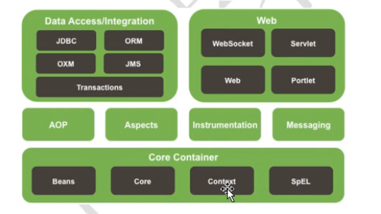
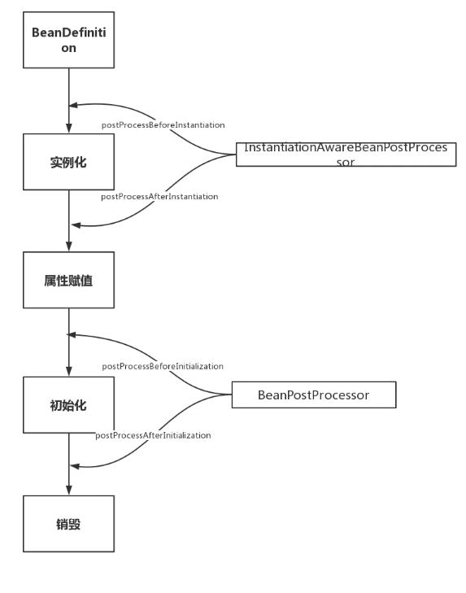

### 一、spring概述

1.spring的优良特性

> - 非侵入式：基于spring开发的应用中的对象可以不依赖于spring的api
> - 依赖注入：DI-Dependency injection，反转控制（IOC）是经典的实现
> - 面向切面编程：Aspect Oriented Programming —— AOP
> - 容器：spring是一个容器，因为他包含并且管理应用对象的生命周期
> - 组件化：spring实现了使用简单的组件配置组合成一个复杂的应用，在spring中可以使用xml和java注解组合这些对象
> - 一站式：在IOC和AOP的基础上可以整合各种企业应用的开源框架和优秀的第三方类库（实际spring自身也提供了表述层的springmvc和持久层的spring jdbc）

2.spring模块

3.IOC和DI

IOC（Inversion Of Control）反转控制

    原先由开发人员管理的对象，都将统一交由spring容器同一管理

DI(Dependency Injection)依赖注入：

    IOC的另一种表达方式，即组件以一些预先定义好的方式接受来自于容器的资源注入，IOC为一种思想，DI为具体的实现方式
    
使用bean工厂管理的对象，使用java的反射原理，反射使用的为对象的无参构造

4.IOC容器在spring中的实现

    spring中由IOC思想，IOC思想必须基于IOC容器来完成，而IOC容器在最底层实质上就是一个对象工厂。
> 在通过IOC容器读取bean实例之前，需要先将IOC容器本身实例化
> spring提供了IOC容器的两种实现方式：
    
    ① BeanFactory：IOC的基本是实现，是spring内部的基础设施，是面向spring本身的，不是提供给开发人员使用的
    ② ApplicationContext：BeanFatory的子接口，提供更多高级特性，面向spring的使用者，几乎所有场合都使用ApplicationContext而不是底层的BeanFactory
    
### 二、spring bean

1.作用域

|  作用域  |  描述  |
|----|----|
| singleton | 在spring IoC容器仅存在一个Bean实例，Bean以单例方式存在，bean作用域范围的默认值（单例） |
| prototype | 每次从容器中调用Bean时，都返回一个新的实例，即每次调用getBean()时，相当于执行newXxxBean() |
| request | 每次HTTP请求都会创建一个新的Bean，该作用域仅适用于web的Spring WebApplicationContext环境,如果开发者使用了Spring Web MVC框架的话，每一个请求都会通过Spring的DispatcherServlet来处理 |
| session | 同一个HTTP Session共享一个Bean，不同Session使用不同的Bean。该作用域仅适用于web的Spring WebApplicationContext环境 |
| application | 限定一个Bean的作用域为ServletContext的生命周期。该作用域仅适用于web的Spring WebApplicationContext环境 |

> - singleton：如果bean的作用域的属性被声明为singleton，那么Spring Ioc容器只会创建一个共享的bean实例。对于所有的bean请求，只要id与该bean定义的相匹配，那么Spring在每次需要时都返回同一个bean实例<bean ...scope="singleton">
> - prototype：当一个bean的作用域为prototype，表示一个bean定义对应多个对象实例。声明为prototype作用域的bean会导致在每次对该bean请求（将其注入到另一个bean中，或者以程序的方式调用容器的getBean()方法）时都会创建一个新的bean实例。prototype是原型类型，它在我们创建容器的时候并没有实例化，而是当我们获取bean的时候才会去创建一个对象，而且我们每次获取到的对象都不是同一个对象。根据经验，对有状态的bean应该使用prototype作用域，而对无状态的bean则应该使用singleton作用域
> - request：当http请求调用作用域为request的bean的时候，每增加一个HTTP请求，Spring就会创建一个新的bean，在请求处理完成之后便及时销毁这个bean。开发者可以随意改变实例的状态，因为通过loginAction请求来创建的其他实例根本看不到开发者改变的实例状态，所有创建的Bean实例都是根据独立的请求来的
> - session：Session中所有http请求共享同一个请求的bean实例。Session结束后就销毁bean
> - application：application作用域是每个ServletContext中包含一个，而不是每个SpringApplicationContext之中包含一个（某些应用中可能包含不止一个ApplicationContext），application作用域仅仅作为ServletContext的属性可见，单例Bean是ApplicationContext可见

> request,session和application这三个作用域都是基于web的Spring WebApplicationContext实现的，只有在web环境下（比如XmlWebApplicationContext）中才能使用 (ApplicationContext applicationContext1 = new XmlWebApplicationContext();)

2.生命周期

参考：https://www.jianshu.com/p/1dec08d290c1
    https://www.cnblogs.com/zrtqsk/p/3735273.html

> - 实例化 Instantiation
> - 属性赋值 Populate
> - 初始化 Initialization
> - 销毁 Destruction

> 实例化 -> 属性赋值 -> 初始化 -> 销毁

### 三、BeanFactory和ApplicationContext的区别

> BeanFactory和ApplicationContext是Spring的两大核心接口，都可以当做Spring的容器。其中ApplicationContext是BeanFactory的子接口

BeanFactory：
> BeanFactory是Spring容器的基础接口，提供了基础的容器访问能力,提供懒加载方式，只有通过getBean方法调用获取Bean才会进行实例化,常用的是加载XMLBeanFactory

ApplicationContext：
> ApplicationContext继承自BeanFactory接口，ApplicationContext包含了BeanFactory中所有的功能，在容器启动时，一次性创建了所有的Bean，具有自己独特的特性：
> - 继承MessageSource，因此支持国际化
> - 统一的资源文件访问方式
> - 提供在监听器中注册bean的事件
> - 同时加载多个配置文件
> - 载入多个（有继承关系）上下文 ，使得每一个上下文都专注于一个特定的层次，比如应用的web层

### 四、Spring的7种事务传播行为
| 事务行为   | 解释说明   |
|----|----|
| PROPAGATION_REQUIRED | 如果当前没有事务，就创建一个新事务，如果当前存在事务，就加入该事务，该设置是最常用的设置 |
| PROPAGATION_SUPPORTS | 支持当前事务，如果当前存在事务，就加入该事务，如果当前不存在事务，就以非事务执行 |
| PROPAGATION_MANDATORY	 | 支持当前事务，如果当前存在事务，就加入该事务，如果当前不存在事务，就抛出异常 |
| PROPAGATION_REQUIRES_NEW | 创建新事务，无论当前存不存在事务，都创建新事务 |
| PROPAGATION_NOT_SUPPORTED	 | 以非事务方式执行操作，如果当前存在事务，就把当前事务挂起 |
| PROPAGATION_NEVER	 | 以非事务方式执行，如果当前存在事务，则抛出异常 |
| PROPAGATION_NESTED | 如果当前存在事务，则在嵌套事务内执行。如果当前没有事务，则按REQUIRED属性执行 |

### 四、Spring的5中隔离级别
| 隔离级别   | 解释说明   |
|----|----|
| ISOLATION_DEFAULT | 默认数据库的隔离级别，Mysql默认隔离级别为可重复读，ORACLE默认隔离级别为读已提交 |
| ISOLATION_READ_UNCOMMITTED | 读未提交，允许另一个线程读取当前线程未提交的事务，会导致脏读、幻读和不可重复读 |
| ISOLATION_READ_COMMITTED	 | 读已提交，保证另一个线程所读到的数据为当前线程已提交的，可避免脏读，但不可避免幻读和不可重复读 |
| ISOLATION_REPEATABLE_READ | 可重复读，对同一字段的多次读取结果都是一致的，除非数据是被本身事务自己所修改，可以阻止脏读和不可重复读，但幻读仍有可能发生 |
| SERIALIZABLE	 | spring事务隔离的最高级别，服从ACID的隔离级别，所有的事务依次逐个执行，这样事务之间就完全不可能产生干扰，也就是说，该级别可以防止脏读、不可重复读以及幻读。但是这将严重影响程序的性能。通常情况下也不会用到该级别 |

> - 脏读：脏读就是指当一个事务正在访问数据，并且对数据进行了修改，而这种修改还没有提交到数据库中，这时，另外一个事务也访问这个数据，然后使用了这个数据
> - 幻读：是指当事务不是独立执行时发生的一种现象，例如第一个事务对一个表中的数据进行了修改，这种修改涉及到表中的全部数据行。同时，第二个事务也修改这个表中的数据，这种修改是向表中插入一行新数据。那么，以后就会发生操作第一个事务的用户发现表中还有没有修改的数据行，就好象发生了幻觉一样
> - 不可重复读：是指在一个事务内，多次读同一数据。在这个事务还没有结束时，另外一个事务也访问该同一数据。那么，在第一个事务中的两次读数据之间，由于第二个事务的修改，那么第一个事务两次读到的的数据可能是不一样的。这样就发生了在一个事务内两次读到的数据是不一样的，因此称为是不可重复读